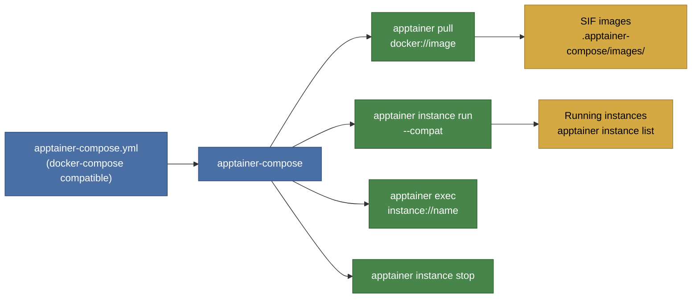

# apptainer-compose

A drop-in replacement for `docker-compose` that uses [Apptainer](https://apptainer.org) as the container runtime. It reads standard `docker-compose.yml` / `apptainer-compose.yml` files and translates them into Apptainer CLI calls, bringing the familiar Compose workflow to HPC and rootless environments where Docker is unavailable.



## Features

- Reads `apptainer-compose.yml`, `compose.yml`, and `docker-compose.yml`
- All 33 docker-compose subcommands (`up`, `down`, `ps`, `logs`, `exec`, `run`, `build`, `pull`, etc.)
- Same CLI flags as docker-compose (`-f`, `-p`, `--env-file`, `--profile`, etc.)
- `${VAR:-default}` environment variable interpolation
- Multi-file merging (`-f base.yml -f override.yml`)
- Service profiles for conditional startup
- `depends_on` with topological ordering and health-check gating
- Named volumes as managed directories
- Service discovery via `/etc/hosts` injection
- Resource limits (`deploy.resources.limits`)
- GPU support (`--nv` for NVIDIA, `--rocm` for AMD)
- Simple Dockerfile-to-def-file conversion for `build:` directives
- Apptainer-specific extensions via `x-apptainer:` per service
- Single statically-linked binary (no dependencies)

## Install

### Download prebuilt binary

Download the latest release for `x86_64` Linux:

```bash
# Download
curl -L -o apptainer-compose \
  https://github.com/mherkazandjian/apptainer-compose/releases/latest/download/apptainer-compose-x86_64-linux

# Make executable
chmod +x apptainer-compose

# Move to PATH
sudo mv apptainer-compose /usr/local/bin/
```

### Build from source

Requires Docker (nothing else needs to be installed):

```bash
git clone https://github.com/mherkazandjian/apptainer-compose.git
cd apptainer-compose

# Release build (static musl binary)
make release

# Binary is at:
# target/x86_64-unknown-linux-musl/release/apptainer-compose
```

Or build manually with a Rust toolchain:

```bash
rustup target add x86_64-unknown-linux-musl
cargo build --release --target x86_64-unknown-linux-musl
```

### Verify the binary is static

```bash
make verify
# Or: ldd target/x86_64-unknown-linux-musl/release/apptainer-compose
# Expected: "not a dynamic executable"
```

## Prerequisites

- [Apptainer](https://apptainer.org/docs/admin/main/installation.html) (or Singularity) installed and on `PATH`
- No root or daemon required

## Quick start

```bash
# Create a compose file
cat > apptainer-compose.yml <<'EOF'
services:
  web:
    image: nginx:alpine
    ports:
      - "8080:80"
EOF

# Pull images and start services
apptainer-compose up -d

# Check running services
apptainer-compose ps

# View logs
apptainer-compose logs

# Stop and clean up
apptainer-compose down
```

## Usage

```
apptainer-compose [OPTIONS] <COMMAND>

Options:
  -f, --file <FILE>               Compose file(s)
  -p, --project-name <NAME>       Project name
      --project-directory <DIR>    Project directory
      --env-file <FILE>            Environment file(s)
      --profile <PROFILE>          Active profile(s)
      --ansi <MODE>                ANSI output control [auto|never|always]
      --dry-run                    Show actions without executing
      --parallel <N>               Max parallel operations (default: 4)
      --compatibility              Compatibility mode
      --all-resources              Include all resources
  -v, --verbose                    Verbose output
  -q, --quiet                      Suppress output

Commands:
  up          Create and start services
  down        Stop and remove services
  ps          List running services
  logs        View service logs
  exec        Execute a command in a running service
  run         Run a one-off command
  build       Build or rebuild services
  pull        Pull service images
  start       Start stopped services
  stop        Stop running services
  restart     Restart services
  config      Validate and view resolved config
  create      Create services without starting
  kill        Force stop services
  rm          Remove stopped services
  pause       Pause services (SIGSTOP)
  unpause     Unpause services (SIGCONT)
  top         Display running processes
  images      List images
  scale       Scale services
  port        Print port mapping info
  version     Show version info
  cp          Copy files to/from services
  stats       Show resource usage
  ls          List projects
  events      Stream real-time events
  wait        Wait for services to stop
  attach      Attach to a service
  push        Push images
  watch       Watch and rebuild
  volumes     List volumes
  export      Export service filesystem
  commit      Create image from changes
```

## Docker Compose to Apptainer mapping

| Docker Compose | Apptainer |
|---|---|
| `image: nginx:latest` | `apptainer pull docker://nginx:latest` |
| `docker run -d` | `apptainer instance run --compat` |
| `docker exec` | `apptainer exec instance://name` |
| `volumes: [./data:/data]` | `--bind ./data:/data` |
| Named volumes | Managed dirs at `.apptainer-compose/volumes/` |
| `environment:` | `--env KEY=VALUE` |
| `env_file:` | `--env-file path` |
| `ports:` | No-op (host networking) -- used for documentation |
| `networks:` | `/etc/hosts` injection (all services on 127.0.0.1) |
| `hostname:` | `--hostname name` |
| `dns:` | `--dns servers` |
| `cap_add/cap_drop` | `--add-caps` / `--drop-caps` |
| `deploy.resources.limits.cpus` | `--cpus` |
| `deploy.resources.limits.memory` | `--memory` |
| `privileged: true` | `--fakeroot` (approximate) |
| `runtime: nvidia` | `--nv` |
| `working_dir:` | `--cwd` |
| `stop_signal:` | `instance stop --signal` |
| `stop_grace_period:` | `instance stop --timeout` |

## Apptainer extensions

Per-service Apptainer-specific configuration via `x-apptainer:`:

```yaml
services:
  ml-training:
    image: pytorch/pytorch:latest
    x-apptainer:
      compat: false         # disable --compat for this service
      fakeroot: true        # run with --fakeroot
      nv: true              # NVIDIA GPU (--nv)
      rocm: true            # AMD GPU (--rocm)
      writable_tmpfs: true  # writable tmpfs overlay
      cleanenv: true        # clean environment
      containall: true      # full isolation
      sandbox: true         # use sandbox instead of SIF
      bind_extra:           # additional bind mounts
        - /scratch:/scratch
      overlay:              # filesystem overlays
        - /path/to/overlay.img
      security:             # security options
        - seccomp:profile.json
      def_file: ./my.def    # use native def file instead of Dockerfile
```

## Examples

| Example | Description |
|---|---|
| [00-hello-world](examples/00-hello-world/) | Minimal single-container setup |
| [01-web-server](examples/01-web-server/) | Nginx with port mapping and restart policy |
| [02-multi-service](examples/02-multi-service/) | Three independent services (API, worker, cache) |
| [03-environment-variables](examples/03-environment-variables/) | Inline vars, env_file, and `${VAR:-default}` interpolation |
| [04-volumes](examples/04-volumes/) | Named volumes, read-only mounts, bind mounts |
| [05-depends-on](examples/05-depends-on/) | Service startup ordering with dependency chains |
| [06-healthcheck](examples/06-healthcheck/) | Health checks with `condition: service_healthy` gating |
| [07-gpu-nvidia](examples/07-gpu-nvidia/) | NVIDIA GPU passthrough via deploy syntax and `x-apptainer` |
| [08-build-from-dockerfile](examples/08-build-from-dockerfile/) | Building images from Dockerfiles |
| [09-multi-file-override](examples/09-multi-file-override/) | Base + override file merging (`-f base -f override`) |
| [10-profiles](examples/10-profiles/) | Conditional services with `--profile debug/monitoring` |
| [11-resource-limits](examples/11-resource-limits/) | CPU and memory constraints via `deploy.resources` |
| [12-web-database](examples/12-web-database/) | Realistic 3-tier app (nginx, API, postgres, redis, worker) |
| [13-apptainer-extensions](examples/13-apptainer-extensions/) | All `x-apptainer` extension fields |
| [14-dns-and-networking](examples/14-dns-and-networking/) | DNS, hostnames, network aliases, extra_hosts |
| [15-full-stack-app](examples/15-full-stack-app/) | Production-grade stack with all features combined |

## Development

All development commands run in Docker containers. Only Docker is required on the host.

```bash
make help           # Show all targets
make build          # Debug build
make release        # Release build
make check          # cargo check
make clippy         # cargo clippy
make fmt            # Check formatting
make fmt-fix        # Apply formatting
make test           # Unit tests
make test integration=1   # Unit + integration tests
make test-integration     # Integration tests only (needs --privileged)
make verify         # Verify binary is statically linked
make all            # fmt + check + clippy + test + build
```

## Project layout

```
apptainer-compose/
├── src/
│   ├── main.rs                 # Entry point
│   ├── error.rs                # Error types (thiserror)
│   ├── logging.rs              # Tracing setup
│   ├── cli/                    # CLI (clap derive)
│   │   ├── mod.rs              # Global options, command dispatch
│   │   └── commands/           # 33 subcommand handlers
│   ├── compose/                # Compose file handling
│   │   ├── types.rs            # Data model (ComposeFile, Service, ...)
│   │   ├── parser.rs           # YAML loading, validation
│   │   ├── interpolation.rs    # ${VAR:-default} substitution
│   │   ├── merge.rs            # Multi-file merging
│   │   └── normalize.rs        # Short-form to long-form conversion
│   ├── planner/                # Orchestration planning
│   │   ├── dependency.rs       # Topological sort (Kahn's algorithm)
│   │   ├── actions.rs          # Action types
│   │   └── reconciler.rs       # Desired vs actual state diffing
│   ├── driver/                 # Apptainer runtime interface
│   │   ├── apptainer.rs        # CLI wrapper (detect, run, stop, exec, pull, build)
│   │   ├── image.rs            # Image pull/build/cache management
│   │   ├── instance.rs         # Instance lifecycle
│   │   ├── network.rs          # /etc/hosts generation
│   │   ├── volume.rs           # Volume directory management
│   │   └── logs.rs             # Log streaming
│   └── state/                  # Persistent state
│       ├── project.rs          # State JSON serialization
│       └── lock.rs             # File-based locking (flock)
├── examples/                   # 16 example compose files
├── tests/integration/          # Integration test suite
├── Makefile                    # Docker-based build/test/lint
├── Cargo.toml
└── Cargo.lock
```

## Known limitations

- **No network isolation** -- Apptainer uses host networking; port conflicts are possible between projects
- **No Docker volume drivers** -- Only local bind mounts
- **Complex Dockerfiles unsupported** -- Multi-stage builds, `COPY --from`, etc. require a native `.def` file via `x-apptainer.def_file`
- **`privileged: true`** -- Approximated with `--fakeroot`, not true root
- **Restart policies with `up -d`** -- No persistent supervisor daemon; restart monitoring runs in foreground mode only

## Related projects

### [singularity-compose](https://github.com/singularityhub/singularity-compose)

A Python-based orchestration tool for Singularity containers by Vanessa Sochat ([JOSS paper](https://joss.theoj.org/papers/10.21105/joss.01578)). It uses its own YAML format (`instances:` instead of `services:`) and is not a docker-compose drop-in replacement. The project has been largely inactive since mid-2024.

apptainer-compose addresses the majority of singularity-compose's open and historical issues by design:

| singularity-compose issue | Status | How apptainer-compose solves it |
|---|---|---|
| [#50](https://github.com/singularityhub/singularity-compose/issues/50) Named volumes not supported | Fixed | Managed volume directories at `.apptainer-compose/volumes/` |
| [#25](https://github.com/singularityhub/singularity-compose/issues/25) No environment variable support | Fixed | Full `environment:`, `env_file:`, and `${VAR:-default}` interpolation |
| [#65](https://github.com/singularityhub/singularity-compose/issues/65) No healthcheck support | Fixed | `healthcheck:` with `condition: service_healthy` dependency gating |
| [#60](https://github.com/singularityhub/singularity-compose/issues/60), [#73](https://github.com/singularityhub/singularity-compose/issues/73) Broken CNI networking, unwanted auto-config | Fixed | Host networking with `/etc/hosts` injection -- no CNI, no sudo, no surprises |
| [#24](https://github.com/singularityhub/singularity-compose/issues/24), [#38](https://github.com/singularityhub/singularity-compose/issues/38), [#39](https://github.com/singularityhub/singularity-compose/issues/39) Requires root/sudo | Fixed | Fully rootless via `--compat`; no sudo for networking or ports |
| [#68](https://github.com/singularityhub/singularity-compose/issues/68), [#63](https://github.com/singularityhub/singularity-compose/issues/63), [#22](https://github.com/singularityhub/singularity-compose/issues/22) Python version/dependency issues | Fixed | Single static Rust binary -- no runtime dependencies |
| [#58](https://github.com/singularityhub/singularity-compose/issues/58), [#43](https://github.com/singularityhub/singularity-compose/issues/43) No persistent/background containers | Fixed | `apptainer instance run` launches background instances with runscript |
| [#35](https://github.com/singularityhub/singularity-compose/issues/35) Should follow compose standard | Fixed | Reads standard `docker-compose.yml` / Compose Spec format |
| [#13](https://github.com/singularityhub/singularity-compose/issues/13) No --fakeroot option | Fixed | `privileged: true` or `x-apptainer.fakeroot: true` |
| [#26](https://github.com/singularityhub/singularity-compose/issues/26) Unreachable hosts between services | Fixed | `/etc/hosts` maps all services to `127.0.0.1` on shared host network |

## License

MIT
