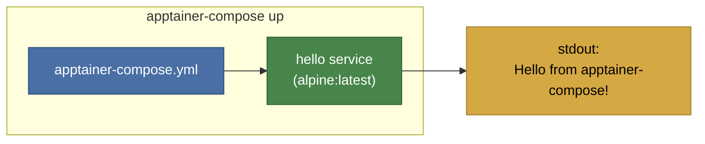

# Example 00 - Hello World

The simplest possible apptainer-compose setup. A single Alpine container runs, prints a greeting, and exits. This is the starting point for verifying that your apptainer-compose installation works.



## Usage

```bash
cd examples/00-hello-world
apptainer-compose up
```

## What it demonstrates

- Minimal `apptainer-compose.yml` structure
- Defining a single service with an image and a command
- Running a one-shot container that prints output and exits
