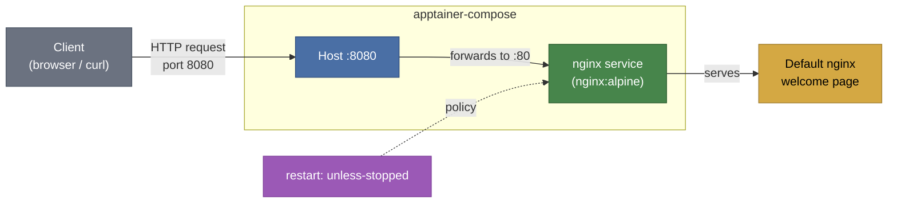

# Example 01 - Web Server

A single nginx web server exposed on port 8080 with a restart policy. This example shows how to run a long-lived network service and access it from the host.



## Usage

```bash
cd examples/01-web-server
apptainer-compose up -d
curl http://localhost:8080
```

## What it demonstrates

- Running a long-lived service in the background
- Port mapping from host to container (`8080:80`)
- Restart policy (`unless-stopped`) for automatic recovery
