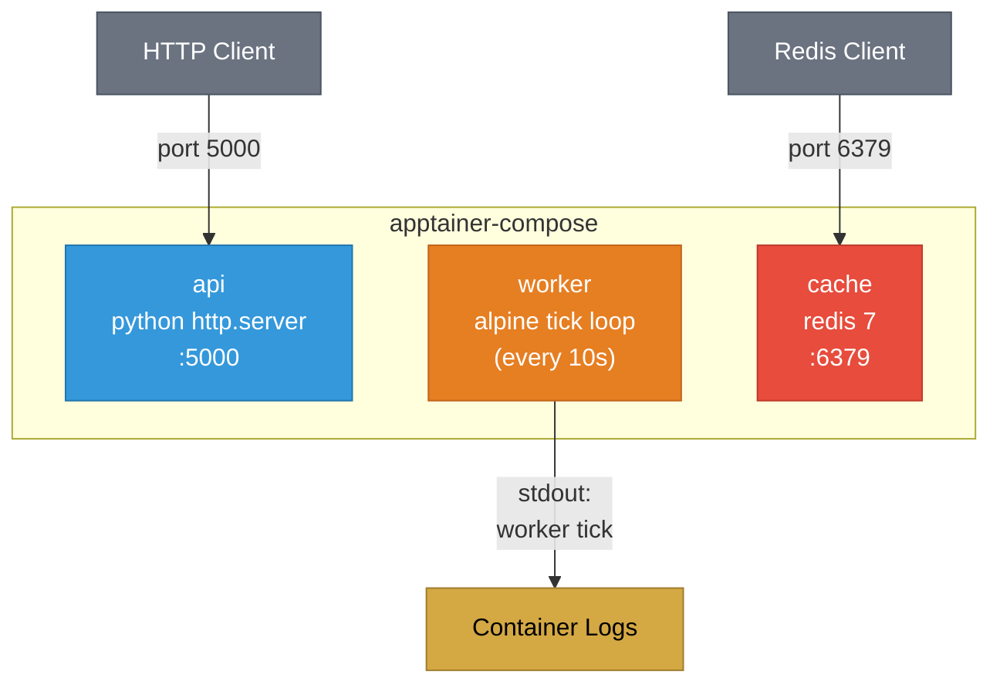

# Example 02 - Multi-Service

Three independent services running side by side: an HTTP API, a background worker, and a Redis cache. This demonstrates orchestrating multiple containers from a single compose file.



## Usage

```bash
cd examples/02-multi-service
apptainer-compose up -d
curl http://localhost:5000
redis-cli -p 6379 ping
```

## What it demonstrates

- Running multiple independent services from one compose file
- Different image sources (Python, Alpine, Redis)
- Multiple port mappings across services
- Long-running background processes (worker loop)
