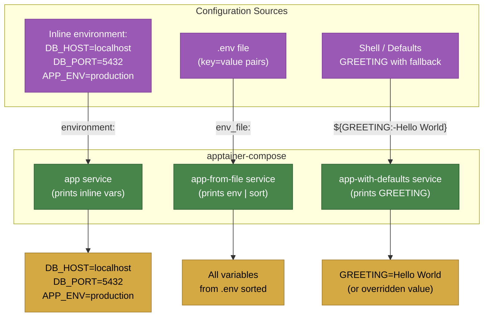

# Example 03 - Environment Variables

Three services showcasing the different ways to inject configuration into containers: inline key-value pairs, an external `.env` file, and variable interpolation with default values.



## Usage

```bash
cd examples/03-environment-variables

# Run with defaults
apptainer-compose up

# Override an interpolated variable
GREETING="Howdy" apptainer-compose up
```

## What it demonstrates

- Inline `environment:` key-value definitions
- Loading variables from an external file with `env_file:`
- Variable interpolation using `${VAR:-default}` syntax
- How to override interpolated variables from the host shell
