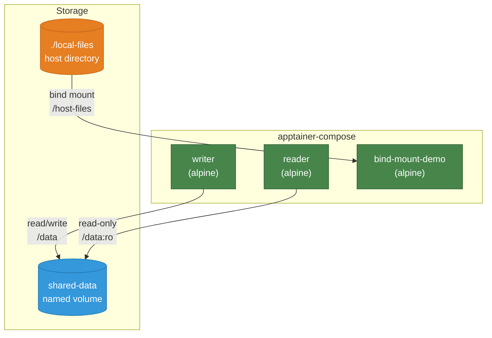

# Example 04 - Volumes

Demonstrates data sharing between containers using named volumes and host bind mounts. A writer service produces data, a reader service consumes it read-only, and a third service maps a local directory into the container.



## Usage

```bash
cd examples/04-volumes
mkdir -p local-files
echo "hello from host" > local-files/greeting.txt
apptainer-compose up
```

## What it demonstrates

- Named volumes shared between multiple services
- Read-only volume mounts (`:ro` suffix)
- Bind mounts mapping host directories into containers
- Top-level `volumes:` declaration for named volumes
