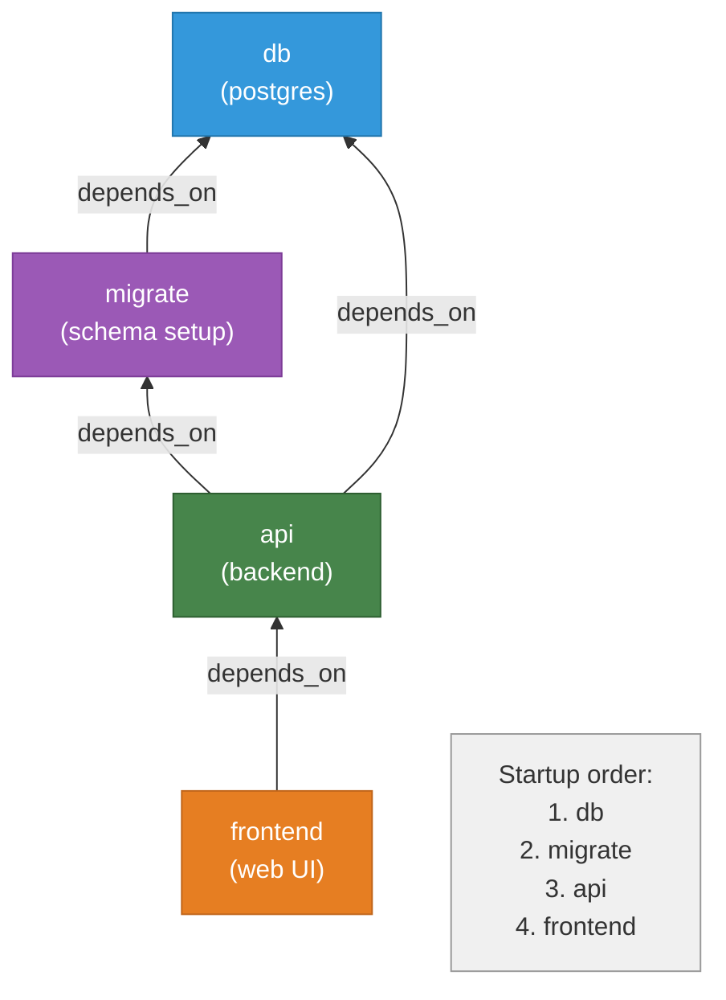

# Example 05 - Depends On

Four services with an explicit dependency chain that controls startup order. The database starts first, then the migration runs, then the API, and finally the frontend -- each waiting for its dependencies before launching.



## Usage

```bash
cd examples/05-depends-on
apptainer-compose up
```

## What it demonstrates

- Service startup ordering with `depends_on:`
- Dependency chains across multiple levels
- Ensuring a database is running before migrations execute
- Ensuring migrations complete before the API starts
- Sequential and fan-in dependency patterns
