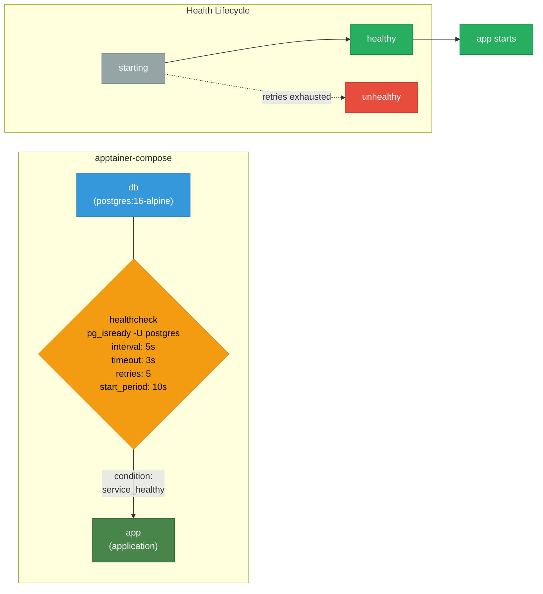

# Example 06 - Healthcheck

A PostgreSQL database with a health check and an application that waits until the database reports healthy before starting. This goes beyond simple `depends_on` ordering by verifying the service is actually ready to accept connections.



## Usage

```bash
cd examples/06-healthcheck
apptainer-compose up
```

## What it demonstrates

- Defining a `healthcheck:` with test command, interval, timeout, retries, and start period
- Using `depends_on:` with `condition: service_healthy`
- Difference between startup ordering (`depends_on`) and readiness verification (healthcheck)
- Reliable database-backed application startup
