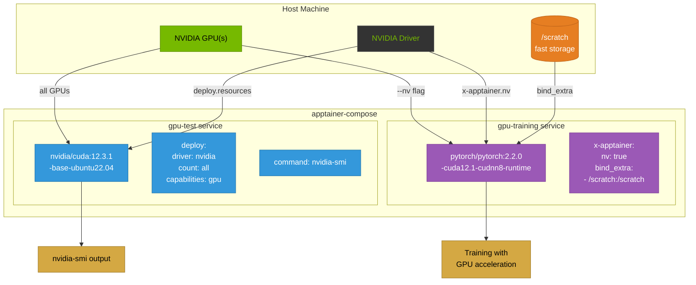

# Example 07 - GPU (NVIDIA)

Two services demonstrating GPU passthrough for compute workloads. The first uses standard Docker Compose `deploy` syntax to request NVIDIA GPUs. The second uses the `x-apptainer` extension to enable Apptainer's native `--nv` flag and extra bind mounts for a PyTorch training environment.



## Usage

```bash
cd examples/07-gpu-nvidia

# Run the nvidia-smi diagnostic
apptainer-compose up gpu-test

# Run a GPU training workload
apptainer-compose up gpu-training
```

## What it demonstrates

- GPU passthrough using Docker Compose `deploy.resources.reservations.devices` syntax
- Apptainer-native GPU support via the `x-apptainer.nv` extension flag
- Extra bind mounts with `x-apptainer.bind_extra` for scratch storage
- Compatibility between Docker Compose GPU syntax and Apptainer's `--nv` flag
- Running CUDA and PyTorch workloads in containers
