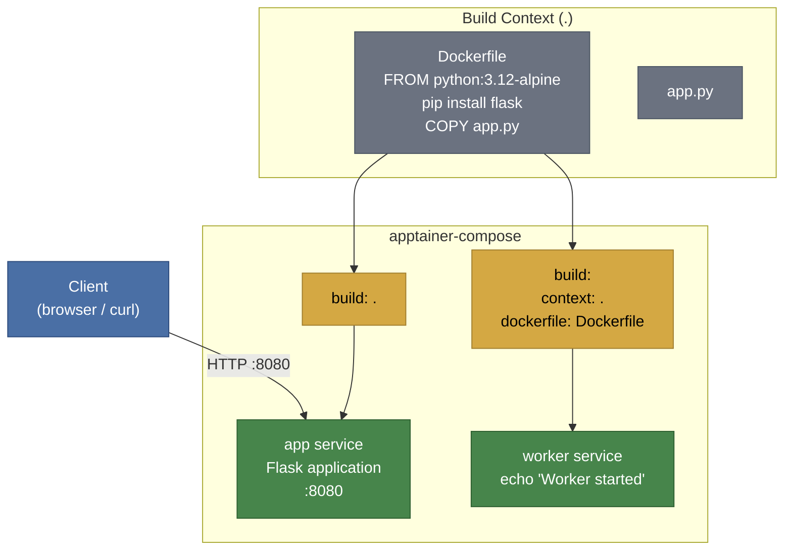

# Example 08 - Build from Dockerfile

Build container images directly from a Dockerfile. apptainer-compose converts Dockerfiles into Apptainer definition files behind the scenes, letting you reuse existing Docker build workflows. This example includes a Flask application service built with a shorthand `build: .` and a worker service using the explicit `build.context` / `build.dockerfile` syntax.



## Usage

```bash
cd examples/08-build-from-dockerfile
apptainer-compose up
```

## What it demonstrates

- Building images from a Dockerfile (`build: .` shorthand)
- Explicit build configuration with `context` and `dockerfile` fields
- Dockerfile-to-Apptainer definition file conversion
- Port mapping and environment variables on built images
