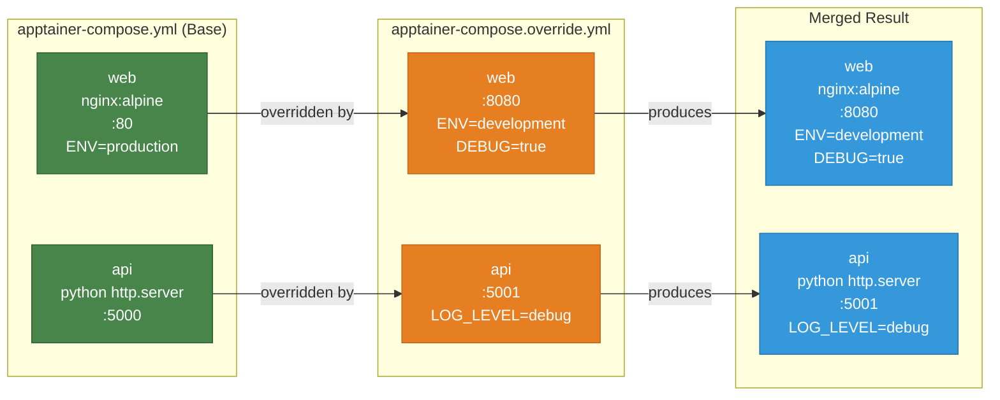

# Example 09 - Multi-File Override

Separate configuration into a base compose file and an override file. The base file defines production defaults, while the override file layers development-specific changes on top -- different ports, extra environment variables, and debug settings. This pattern keeps production config clean and lets developers customize behavior without editing the shared file.



## Usage

```bash
cd examples/09-multi-file-override

# Run with both files (base + override)
apptainer-compose -f apptainer-compose.yml -f apptainer-compose.override.yml up

# Run base only (production defaults)
apptainer-compose -f apptainer-compose.yml up
```

## What it demonstrates

- Splitting configuration across multiple compose files
- Override files that modify ports, environment variables, and other settings
- The `-f` flag to specify which compose files to merge
- A clean pattern for separating production and development configuration
