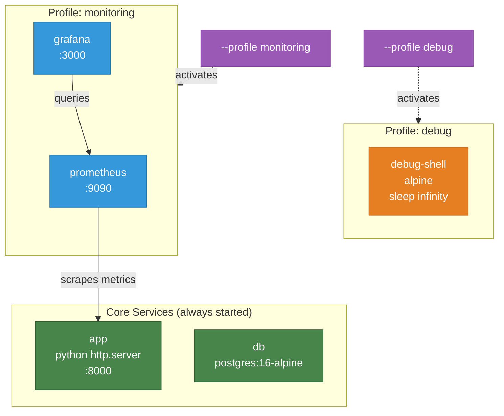

# Example 10 - Profiles

Conditionally start services based on named profiles. Core services (app and db) run every time, while optional services like a debug shell or monitoring stack only start when their profile is explicitly activated. This avoids running heavyweight tools during normal development while keeping them one flag away.



## Usage

```bash
cd examples/10-profiles

# Start only core services (app + db)
apptainer-compose up

# Start core services + debug shell
apptainer-compose --profile debug up

# Start core services + monitoring stack
apptainer-compose --profile monitoring up

# Start everything
apptainer-compose --profile debug --profile monitoring up
```

## What it demonstrates

- The `profiles` field for conditional service startup
- Core services with no profile that always run
- Activating optional services via `--profile <name>`
- Combining multiple profiles in a single command
