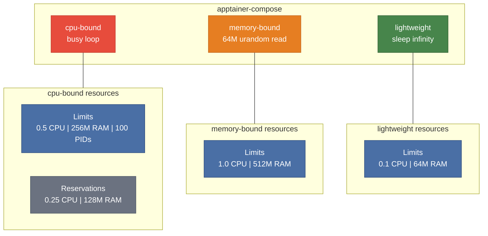

# Example 11 - Resource Limits

Apply CPU and memory constraints to containers using the `deploy.resources` section. apptainer-compose translates these into Apptainer cgroup flags (`--cpus`, `--memory`, `--pids-limit`). Three services demonstrate different resource profiles -- from a CPU-intensive workload to a minimal background task.



## Usage

```bash
cd examples/11-resource-limits
apptainer-compose up -d
```

## What it demonstrates

- Setting CPU limits (`cpus`) and memory limits (`memory`) via `deploy.resources.limits`
- Setting resource reservations via `deploy.resources.reservations`
- PID limits (`pids`) to restrict the number of processes
- Translation of Docker Compose resource syntax to Apptainer cgroup flags
