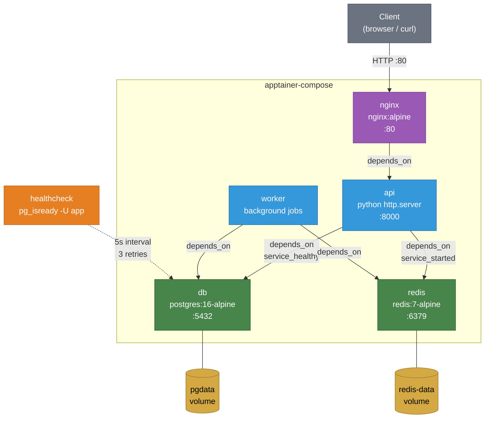

# Example 12 - Web Database

A realistic multi-tier web application with a PostgreSQL database, Redis cache, API server, background worker, and nginx reverse proxy. Services declare dependencies with health-check conditions so the API only starts after the database is confirmed healthy. Named volumes persist data across restarts.



## Usage

```bash
cd examples/12-web-database
apptainer-compose up -d
curl http://localhost
```

## What it demonstrates

- Multi-tier architecture with database, cache, API, worker, and reverse proxy
- Health-check-based dependency ordering (`condition: service_healthy`)
- Named volumes for persistent data (`pgdata`, `redis-data`)
- Redis append-only file (AOF) persistence via a custom command
- A full dependency chain from nginx down to the data layer
