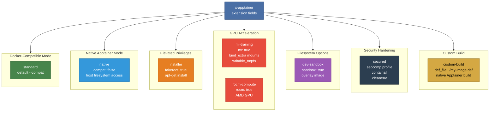

# Example 13 - Apptainer Extensions

Showcases the `x-apptainer` extension fields that unlock Apptainer-specific features beyond standard Docker Compose syntax. Eight services demonstrate the full range of extensions -- from GPU passthrough and fakeroot privileges to sandbox mode, overlay filesystems, security policies, and native Apptainer definition file builds.



## Usage

```bash
cd examples/13-apptainer-extensions

# Run all services
apptainer-compose up

# Run a specific service to test one feature
apptainer-compose up installer
```

## What it demonstrates

- `compat: false` -- disable Docker compatibility for native Apptainer behavior
- `fakeroot: true` -- run as fake root to install packages without real privileges
- `nv: true` -- NVIDIA GPU passthrough for CUDA workloads
- `rocm: true` -- AMD ROCm GPU passthrough
- `bind_extra` -- additional host-to-container bind mounts
- `writable_tmpfs` -- writable temporary filesystem layer
- `sandbox: true` and `overlay` -- mutable sandbox containers with overlay images
- `containall`, `cleanenv`, and `security` -- isolation and seccomp hardening
- `def_file` -- build from a native Apptainer definition file instead of a Dockerfile
