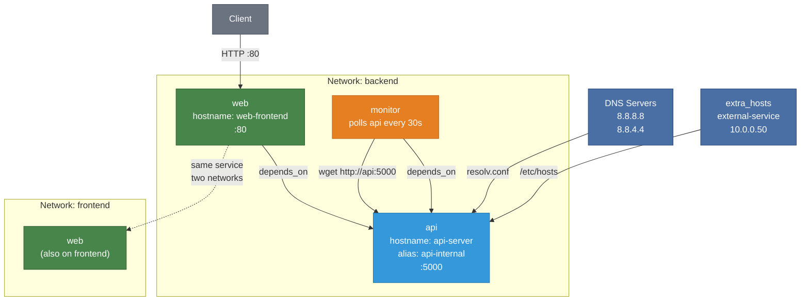

# Example 14 - DNS and Networking

Configure hostnames, DNS servers, extra host entries, network aliases, and multi-network membership. In Apptainer, all services share the host network by default and reach each other via an injected `/etc/hosts` file. This example shows how to layer additional networking configuration on top of that foundation.



## Usage

```bash
cd examples/14-dns-and-networking
apptainer-compose up -d
curl http://localhost
```

## What it demonstrates

- Custom `hostname` for services
- Custom `dns` server configuration
- `extra_hosts` for injecting entries into `/etc/hosts`
- Network aliases (`aliases`) for alternative service names
- Attaching a service to multiple networks (`backend` + `frontend`)
- Service discovery via injected `/etc/hosts` in Apptainer's host-networking model
