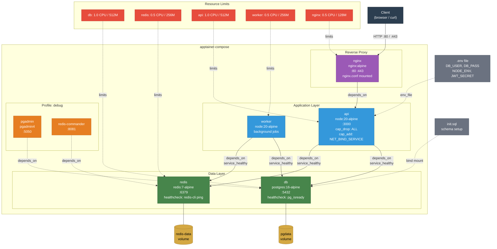

# Example 15 - Full-Stack App

A production-grade application demonstrating most Docker Compose features working together under apptainer-compose. Seven services form a complete stack: PostgreSQL and Redis as the data layer, a Node.js API and background worker as the application layer, nginx as the reverse proxy, and pgAdmin plus Redis Commander available on-demand via the debug profile. The configuration uses `.env` variable substitution, init scripts, health checks, resource limits, restart policies, capability controls, and named volumes.



## Usage

```bash
cd examples/15-full-stack-app

# Start core services (db, redis, api, worker, nginx)
apptainer-compose up -d

# Start everything including debug tools (pgAdmin, redis-commander)
apptainer-compose --profile debug up -d

# Access the application
curl http://localhost

# Access debug tools (when profile is active)
# pgAdmin:          http://localhost:5050
# Redis Commander:  http://localhost:8081
```

## What it demonstrates

- Full dependency chain with health-check gating (`condition: service_healthy`)
- Environment variable substitution from a `.env` file with fallback defaults
- Named volumes for persistent database and cache storage
- Resource limits (`deploy.resources.limits`) on every service
- Restart policies (`restart: unless-stopped`) for resilience
- Linux capability controls (`cap_drop: ALL`, `cap_add: NET_BIND_SERVICE`)
- Debug-only services gated behind the `debug` profile
- Bind-mounted configuration files (`nginx.conf`, `init.sql`)
- A realistic multi-layer architecture suitable as a project template
