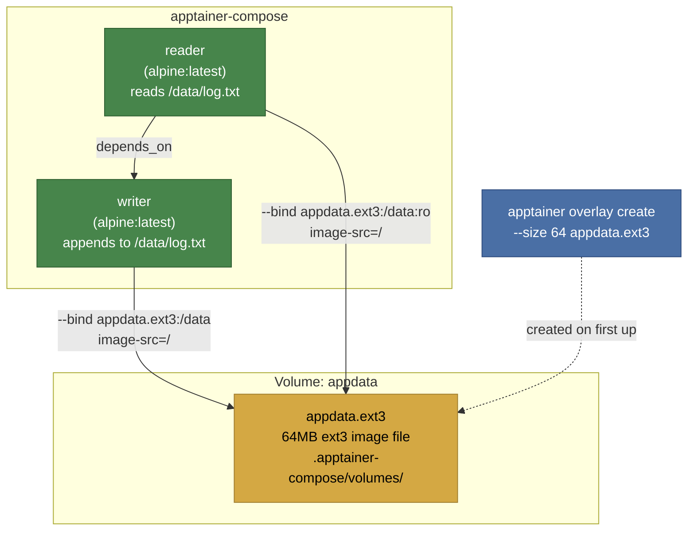

# Example 16 - Ext3 Volume Images

Persistent named volumes backed by ext3 filesystem images instead of plain directories. The volume is created as a `.ext3` image file via `apptainer overlay create` and bound into containers using Apptainer's native `--bind image-src=/` support. Data persists across container restarts. No root required.



## Usage

```bash
cd examples/16-ext3-volumes
apptainer-compose up
```

On first run, apptainer-compose creates a 64MB ext3 image at `.apptainer-compose/volumes/appdata.ext3`. The writer service appends a timestamped line, and the reader prints it. On subsequent runs, data from previous runs is still present in the image.

## What it demonstrates

- Named volumes with `x-apptainer.backend: ext3` for real filesystem images
- Persistent storage that survives container restarts (unlike `--writable-tmpfs`)
- Size-limited volumes (64MB in this example)
- Read-only volume mounts from ext3 images
- Rootless volume creation via `apptainer overlay create`
