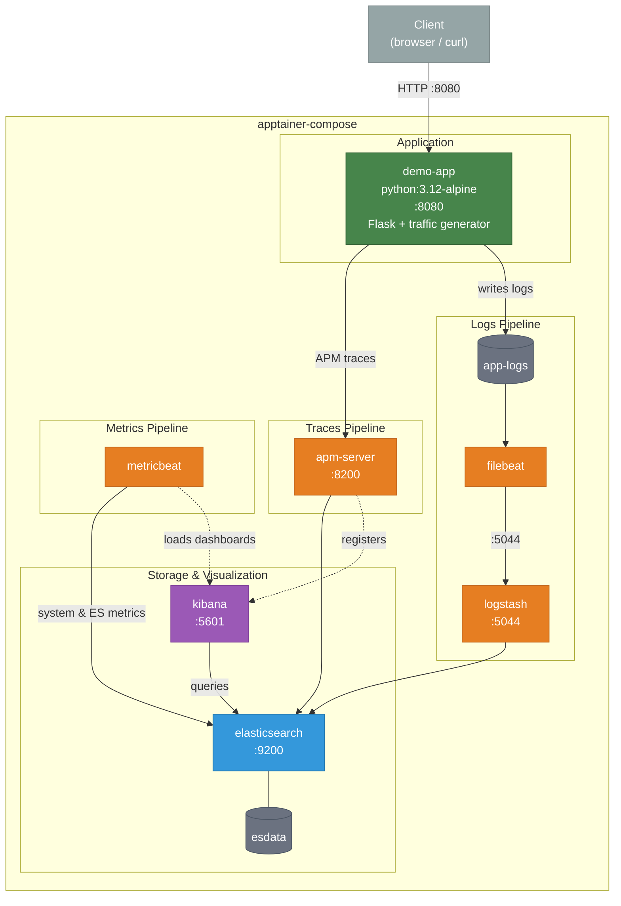

# 17 — Elastic Stack

Full Elastic (ELK) stack with observability: Elasticsearch, Kibana, Logstash,
Filebeat, Metricbeat, APM Server, and a demo application that generates
live traffic, logs, and APM traces.



## Services

| Service         | Port  | Description                                  |
|-----------------|-------|----------------------------------------------|
| elasticsearch   | 9200  | Search & analytics engine                    |
| kibana          | 5601  | Visualization & dashboards                   |
| logstash        | 5044  | Data processing pipeline (Beats input)       |
| apm-server      | 8200  | Application performance monitoring collector |
| filebeat        | —     | Ships demo-app logs → Logstash → ES          |
| metricbeat      | —     | Ships system & ES metrics → ES + dashboards  |
| demo-app        | 8080  | Flask app with APM tracing + traffic gen     |

## Quick start

```bash
apptainer-compose up -d
```

Wait ~60 seconds for everything to initialize, then open:

- **Kibana**: http://localhost:5601
- **Demo app**: http://localhost:8080
- **Elasticsearch**: http://localhost:9200

## What to explore in Kibana

1. **Discover** — search `demo-logs-*` index for application logs
2. **APM** → Services → `demo-app` — request traces, latency, errors
3. **Dashboards** — Metricbeat auto-loads system dashboards (CPU, memory, disk, network)
4. **Observability** — unified view of logs, metrics, and traces

## Tear down

```bash
apptainer-compose down
```
